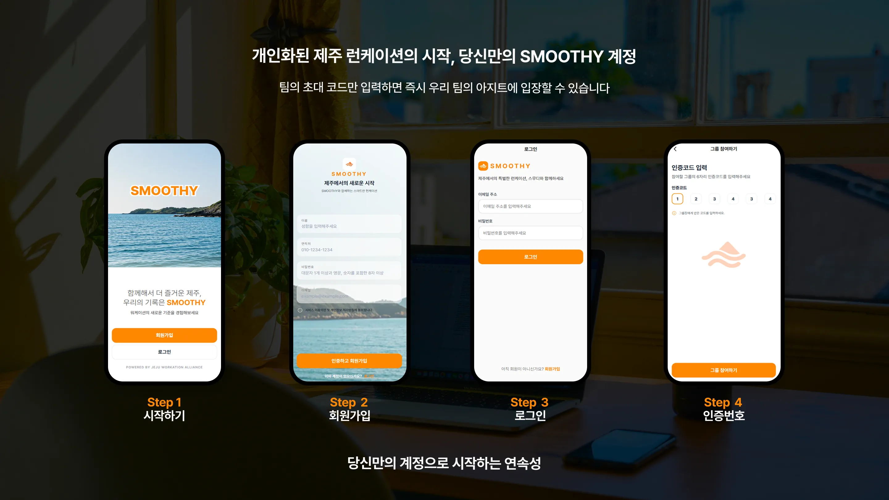

<div align="center"><br/>

# 🍹 JEJU SMOOTHY\*\*

"복잡한 정산은 깔끔하게, 제주 탐방은 스마트하게"\*\*

구름 런케이션 수강생들의 몰입을 방해하는 불편함을 기술로 해결하는 **올인원 라이프 케어 솔루션**

<br/>

[](https://goorm-runcation-jeju.vercel.app/)
[](https://react.dev/)
[](https://www.typescriptlang.org/)
[](https://supabase.com/)

</div>

<br/>

## 1. 프로젝트 개요

| 항목            | 내용                                      |
| --------------- | ----------------------------------------- |
| **프로젝트명**  | JEJU SMOOTHY (제주 스무디)                |
| **타겟 사용자** | 구름 제주 런케이션(Runcation) 참여 수강생 |
| **개발 기간**   | 2025.02.10 ~ 2026.03.06                   |
| **유저 테스트** | 2026.03.08 ~ 2026.03.21                   |
| **배포 환경**   | Vercel                                    |

<br/>

### 핵심 가치

| 가치           | 설명                                                         |
| -------------- | ------------------------------------------------------------ |
| **Efficiency** | 공동체 생활에서 발생하는 N빵 정산을 자동화하여 번거로움 제거 |
| **Experience** | 직접 검증한 제주 로컬 맛집 정보와 방문 인증을 통한 추억 공유 |
| **Connection** | 방명록과 계좌 공유를 통한 수강생 간 유대감 강화              |

<br/>

## 2. 팀원 소개

<div align="center">

|                                                                     이예슬                                                                      |                                                                     김나영                                                                      |                                                                     이권우                                                                      |
| :---------------------------------------------------------------------------------------------------------------------------------------------: | :---------------------------------------------------------------------------------------------------------------------------------------------: | :---------------------------------------------------------------------------------------------------------------------------------------------: |
|  |  |  |
|                                                               **Frontend · 팀장**                                                               |                                                                  **Frontend**                                                                   |                                                                  **Frontend**                                                                   |
|                         프로젝트 계획 및 일정 관리<br/>메인 페이지<br/>그룹 리스트 · 생성 · 참여 페이지<br/>마이 페이지                         |                  Google Places API 연동<br/>Google Maps 연동<br/>맛집 탐방 페이지<br/>(식당 리스트 · 상세)<br/>정산하기 페이지                  |                                       로그인 · 회원가입 페이지<br/>맛집 도장깨기 페이지<br/>방명록 페이지                                       |
|                  [](https://github.com/Leemainsw)                   |                   [](https://github.com/KNY1005)                    |                   [](https://github.com/GwonWooL)                   |

</div>

<br/>

> 🎨 **공통** — UI/UX 디자인 · 공통 컴포넌트 개발

<br/>

## 3. 주요 기능

### 🔐 1. 로그인 · 회원가입

이메일과 비밀번호로 계정을 생성하고, 팀의 **초대 코드**를 입력해 그룹에 바로 합류할 수 있습니다.

- 이메일 · 비밀번호 기반 **회원가입 및 로그인** (Firebase Auth)
- 시작하기 → 회원가입 → 로그인 → 인증코드 입력의 **4단계 온보딩 플로우**
- 6자리 초대 코드 입력으로 즉시 그룹 참여
- 인증된 사용자만 서비스 이용 가능 — **미인증 접근 차단**



---

### 👥 2. 그룹 생성 및 참여

우리 팀만의 전용 공간을 만들고, 팀원들과 함께 제주에서의 모든 활동을 공유할 수 있습니다.

- 그룹명 · 과정 · 기수 입력만으로 **단 10초** 안에 팀 공간 생성
- 생성 시 자동 발급되는 **6자리 초대 코드**로 팀원 초대
- 현재 활성화된 그룹 목록 실시간 확인 및 참여
- 그룹 내 **날씨 정보** 및 미완료 정산 건수 메인 화면 표시


---

### 🍽️ 3. 지역별 맛집 탐방 & 방명록

**Google Places API · Google Maps**를 활용해 제주의 진짜 맛집 정보를 제공합니다. 방문 후 팀원들과 소감을 나눌 수 있는 방명록 기능도 함께 제공합니다.

- **Google Places API** 연동으로 맛집 정보 실시간 제공
- **Google Maps** 기반 위치 확인
- 제주시 · 서귀포시 · 애월 등 **지역 카테고리별** 탐색 및 필터링
- 식당별 평점, 주소, 연락처, 운영시간, 사진 등 **상세 정보** 제공
- 전화번호 · 주소 **원터치 복사** 기능
- 방문한 장소에 사진과 함께 **방명록 작성** — 팀원 전체에게 공유


---

### 🗺️ 4. 도장깨기 (방문 인증)

제주도 각 지역을 직접 방문하고, 사진으로 인증하며 팀원들과 함께 제주 지도를 완성해 나갑니다.

- 제주도 **9개 지역** 도장깨기 챌린지
- 방문 사진 업로드(최대 10MB, JPG/PNG)로 **방문 인증** 및 도장 획득
- 한 줄 기록으로 그날의 **추억 메모** 남기기
- 전체 달성도 · 지역별 잠금 해제 현황 **실시간 확인**
- 팀워크로 완성해가는 **우리만의 제주 지도**


---

### 💰 5. N빵 정산 계산기

여행 중 발생하는 공동 지출을 빠르고 정확하게 정산할 수 있습니다. 복잡한 계산은 앱이 대신하고, 팀원은 송금만 하면 됩니다.

- 그룹 내 **전체 정산 내역** 목록 조회 (지금까지 낸 금액 · 내야 할 금액 한눈에 확인)
- 카테고리 아이콘(식비 · 교통 · 숙박 등)으로 **지출 항목 구분**
- 정산 추가 플로우: 금액 입력 → 카테고리 선택 → 결제자 지정 → **인원별 자동 분배 계산**
- 정산 항목별 **미완료 / 완료 상태 추적** 및 진행률 표시
- 참여자별 입금 여부 확인 및 **계좌번호 복사** 지원


---

### 📱 6. PWA 웹앱 설치 _(예정)_

- 모바일 **홈 화면 설치** 지원
- 별도 앱 다운로드 없이 네이티브 앱과 동일한 실행 경험 제공

<br/>

## 4. 기술 스택

### Frontend


### Language


### Backend & Infra


### Tooling & Collaboration


<br/>

## 5. 프로젝트 구조

```
project/
├── public/
│   └── vite.svg
├── src/
│   ├── assets/          # 이미지, 폰트, 아이콘
│   ├── components/
│   │   ├── common/      # 버튼, 카드 등 공용 컴포넌트
│   │   └── layout/      # Header, Footer 등 레이아웃
│   ├── pages/           # 페이지 컴포넌트
│   ├── features/        # 기능 단위 (정산, 지도 등)
│   ├── hooks/           # 커스텀 훅
│   ├── utils/           # 공통 함수, 포맷터
│   ├── api/             # API 요청 관리
│   ├── store/           # 상태 관리
│   ├── styles/          # 전역 스타일, 테마
│   ├── router/          # React Router 설정
│   ├── App.tsx
│   ├── main.tsx
│   └── index.css
├── package.json
├── tsconfig.json
└── vite.config.ts
```

<br/>

## 6. 개발 워크플로우

### 브랜치 전략

Git Flow 기반으로 운영하며, 아래 두 종류의 브랜치를 사용합니다.

| 브랜치  | 설명                                                                  |
| ------- | --------------------------------------------------------------------- |
| `main`  | 배포 가능한 상태의 코드 유지, 모든 배포는 이 브랜치에서 진행          |
| `{TSK}` | WBS 기반 태스크 단위 개발 브랜치, 기능 개발은 모두 이 브랜치에서 진행 |

<br/>

## 7. 코딩 컨벤션

### 문장 종료

```js
// 세미콜론(;) 사용
console.log("Hello World!");
```

### 명명 규칙

```js
// 상수: 대문자 스네이크 케이스
const NAME_ROLE = "admin";

// 변수 & 함수: 카멜 케이스
const [isLoading, setIsLoading] = useState(false);
const datas = [];

const rName = /.*/; // 정규표현식: 'r'로 시작
const onClick = () => {}; // 이벤트 핸들러: 'on'으로 시작
const isLoggedIn = false; // 불린 반환: 'is'로 시작
const getUserList = () => {}; // Fetch 함수: HTTP method로 시작
```

### 블록 구문

```js
// 한 줄이라도 중괄호 생략 금지
// ✅ Good
if (true) {
  return "hello";
}

// ❌ Bad
if (true) return "hello";
```

### 함수 선언

```js
// 화살표 함수 표현식 사용
// ✅ Good
const fnName = () => {};

// ❌ Bad
function fnName() {}
```

### Styled-Component 태그 네이밍

```jsx
// 전체 영역: Container
// 묶음 영역: {Name}Area
// 의미 없는 태그: Fragment(<>)
<Container>
  <ContentsArea>
    <Contents>...</Contents>
  </ContentsArea>
</Container>
```

### 폴더 & 파일 네이밍

| 대상          | 규칙           | 예시          |
| ------------- | -------------- | ------------- |
| 일반 폴더     | 카멜 케이스    | `customHooks` |
| 컴포넌트 폴더 | 파스칼 케이스  | `MainPage`    |
| 컴포넌트 파일 | `.tsx` 확장자  | `Button.tsx`  |
| 커스텀 훅     | `use` + 함수명 | `useAuth.ts`  |

<br/>

## 8. 커밋 컨벤션

### 기본 구조

```
type: subject

body (선택)
```

### 커밋 타입

| 타입       | 설명                                         |
| ---------- | -------------------------------------------- |
| `feat`     | 새로운 기능 추가                             |
| `fix`      | 버그 수정                                    |
| `docs`     | 문서 수정                                    |
| `style`    | 코드 포맷팅, 세미콜론 누락 등 로직 변경 없음 |
| `refactor` | 코드 리팩토링                                |
| `test`     | 테스트 코드 추가                             |
| `chore`    | 빌드 설정, 패키지 매니저 수정                |

### 커밋 예시

```
feat: 회원 가입 기능 구현

SMS, 이메일 중복 확인 API 연동
```

```
chore: styled-components 라이브러리 설치

UI 개발을 위한 styled-components 설치
```

<br/>

---

<div align="center">

**JEJU SMOOTHY** · Made with 🍹 by Goorm Runcation Team

</div>
